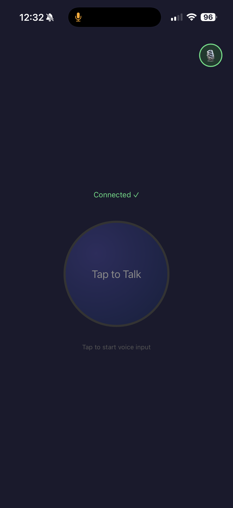
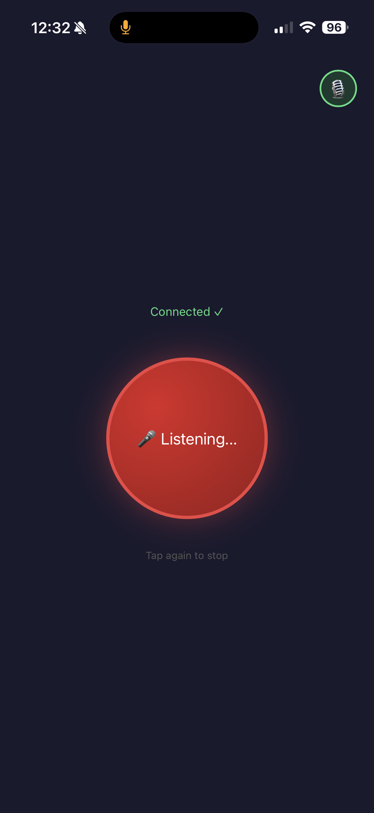

# 🪄 Vibe Coding Magic Button

> 🎤 Turn your phone into a wireless microphone and hotkey trigger for your Mac — over Wi-Fi, with zero apps to install on the phone.

<p align="center">
  
  &nbsp;&nbsp;&nbsp;
  
</p>

## ✨ What It Does

Open a webpage on your phone, tap a button, and:
1. **A hardware-level keypress** is sent to your Mac (via Karabiner VirtualHID)
2. **Your phone's microphone audio** streams to your Mac and plays through a USB audio device

This was built to remotely trigger [Typeless](https://typeless.so) (a voice-to-text app) from anywhere in the house — or even remotely via [Tailscale](https://tailscale.com). Typeless only accepts hardware HID keypresses and physical audio devices, so this project uses two tricks to satisfy those requirements.

## 🔧 How It Works

```
Phone Browser                          Mac
┌──────────────────┐                  ┌──────────────────────────────┐
│  Web page (HTTPS) │   HTTP POST     │  Node.js Server (:2000)      │
│                  │ ─────────────→   │                              │
│  [🎤 Tap to Talk] │  /key/start     │  vhid_key → Karabiner VHID  │
│                  │  /key/stop       │  → macOS treats as real key  │
│                  │                  │                              │
│  getUserMedia()  │  /audio (PCM)    │  sox → USB sound card output │
│  ScriptProcessor │ ─────────────→   │  → loopback cable            │
│                  │                  │  → USB sound card input      │
│                  │                  │  → macOS treats as real mic  │
└──────────────────┘                  └──────────────────────────────┘
```

### The Key Trick
The Mac-side C helper (`vhid_key`) communicates with Karabiner's VirtualHIDDevice daemon via Unix socket to inject keypresses at the IOKit HID layer. macOS sees these as real hardware keyboard events.

### The Audio Trick
Some apps (like Typeless) reject virtual audio devices and only accept physical hardware microphones. To work around this, a cheap USB sound card with a 3.5mm loopback cable (output → input) creates a physical audio path. The phone's audio streams as raw PCM over HTTP, gets played to the USB card's output, travels through the cable, and re-enters as the card's microphone input — a legitimate hardware mic.

**Note:** If your target app accepts virtual audio devices (like BlackHole), you don't need the USB sound card or loopback cable. Just change the audio output device in `server.js` to your virtual device name.

## 📋 Requirements

### Hardware
- A Mac (tested on Mac mini, macOS Ventura+)
- Any phone with a modern browser (iPhone, Android, etc. — tested with Safari and Chrome)
- *(Optional, for apps that reject virtual audio)* A USB external sound card with separate 3.5mm output and input jacks (~$5-10) + a 3.5mm male-to-male aux cable (~$2)

### Software (Mac)
- [Node.js](https://nodejs.org/) (v18+)
- [Karabiner-Elements](https://karabiner-elements.pqrs.org/) (for VirtualHID driver)
  ```bash
  brew install --cask karabiner-elements
  ```
  Enable the driver in System Settings → General → Login Items & Extensions → Driver Extensions
- [sox](https://sox.sourceforge.net/) (audio playback)
  ```bash
  brew install sox
  ```
- [mkcert](https://github.com/FiloSottile/mkcert) (local HTTPS certificates — required for browser microphone access)
  ```bash
  brew install mkcert
  mkcert -install
  ```

### Software (Phone)
- Nothing. Just a browser.

## 🚀 Setup

### 1. Clone and install
```bash
git clone https://github.com/schummiking/vibe-coding-magic-button.git
cd vibe-coding-magic-button
npm install
```

### 2. Compile the key helper
```bash
cc -O2 -o vhid_key vhid_key.c
```

### 3. Generate HTTPS certificates
```bash
mkdir -p certs
mkcert -cert-file certs/cert.pem -key-file certs/key.pem localhost $(ipconfig getifaddr en0)
```
To support VPN access (e.g. Tailscale, NordVPN Meshnet), add those IPs too:
```bash
mkcert -cert-file certs/cert.pem -key-file certs/key.pem localhost 192.168.x.x 100.x.x.x
```

### 4. Install CA certificate on your phone
This is needed so the browser trusts the local HTTPS server (required for microphone access).

1. Copy the root CA to the public folder:
   ```bash
   cp "$(mkcert -CAROOT)/rootCA.pem" public/rootCA.pem
   ```
2. Start the server (see below), then on your phone open:
   ```
   https://<your-mac-ip>:2000/rootCA.pem
   ```
3. **iOS:** Install the profile in Settings → General → VPN & Device Management, then enable trust in Settings → General → About → Certificate Trust Settings
4. **Android:** Install the certificate from your Downloads

### 5. Connect the hardware loopback (if needed)
Only required if your target app rejects virtual audio devices.

Plug the USB sound card into your Mac. Connect a 3.5mm aux cable from the card's **output** jack to its **input** jack.

### 6. Configure your target app
Select "USB Audio Device" (or your virtual audio device) as the microphone input in your target app.

## 📱 Usage

### Start the server
```bash
sudo node server.js
```
Root is required for Karabiner VirtualHID socket access.

### On your phone
Open `https://<your-mac-ip>:2000` in any browser. Tap 🎙️ to enable the microphone, then tap the big button to start/stop.

### Add to Home Screen (iOS)
In Safari, tap Share → Add to Home Screen for an app-like experience.

## ⚙️ Configuration

### Change the trigger key
Edit `vhid_key.c` — change `MOD` and `KEY` constants, then recompile with `cc -O2 -o vhid_key vhid_key.c`:
```c
// Default: Left Option/Alt
const uint8_t MOD = 0x04;    // left_opt modifier bit
const uint16_t KEY = 0xE2;   // Left Option HID usage
```
Common alternatives:
| Key | MOD | KEY |
|-----|-----|-----|
| Left Option/Alt | 0x04 | 0xE2 |
| Right Option/Alt | 0x40 | 0xE6 |
| Left Control | 0x01 | 0xE0 |
| Right Control | 0x10 | 0xE4 |
| Left Command | 0x08 | 0xE3 |
| F5 | 0x00 | 0x3E |

### Change the port
Edit `server.js`:
```javascript
const PORT = 2000;
```

### Change the audio output device
Edit `server.js` — change the sox output device name:
```javascript
'-', '-t', 'coreaudio', 'USB Audio Device'  // ← your device name here
```
Find your device name with: `system_profiler SPAudioDataType`

## 📁 File Structure
```
vibe-coding-magic-button/
├── server.js          # HTTPS server, audio pipeline, key control
├── vhid_key.c         # C helper for Karabiner VirtualHID key injection
├── vhid_key           # Compiled binary (not in repo, build locally)
├── public/
│   ├── index.html     # Phone web UI
│   └── rootCA.pem     # mkcert CA cert for phone trust (not in repo)
├── certs/
│   ├── cert.pem       # HTTPS certificate (not in repo)
│   └── key.pem        # HTTPS private key (not in repo)
└── package.json
```

## ⚠️ Limitations

- Requires the same network (Wi-Fi, Tailscale, or any VPN)
- Phone browser asks for microphone permission on each page load (self-signed cert limitation)
- Audio has slight latency (~200-400ms) due to HTTP chunked transfer
- Server needs root privileges for VirtualHID access
- macOS only (depends on Karabiner and CoreAudio)

## 📄 License

MIT
